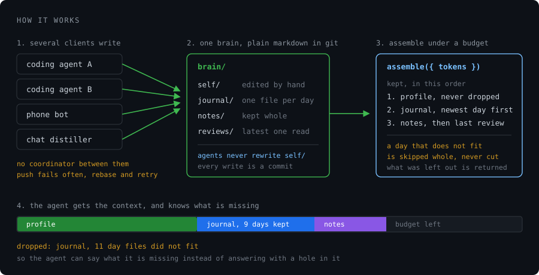
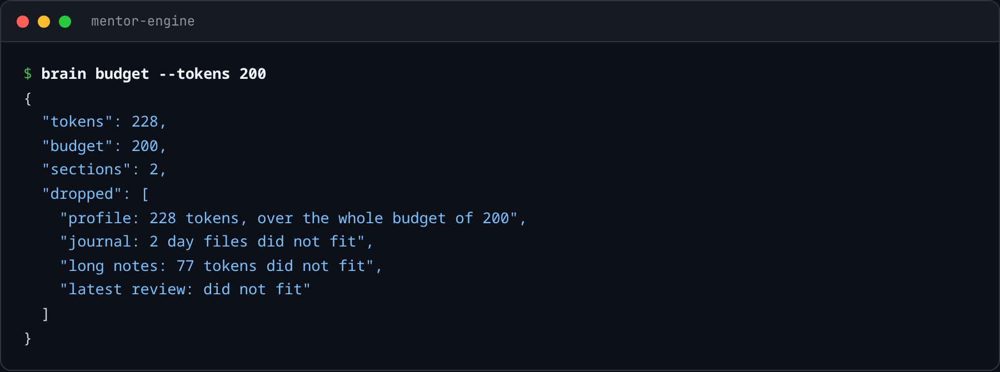
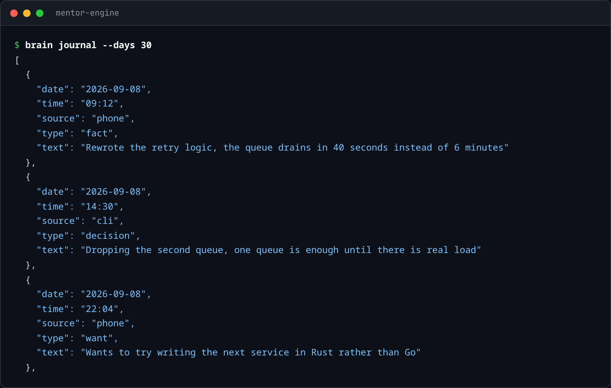
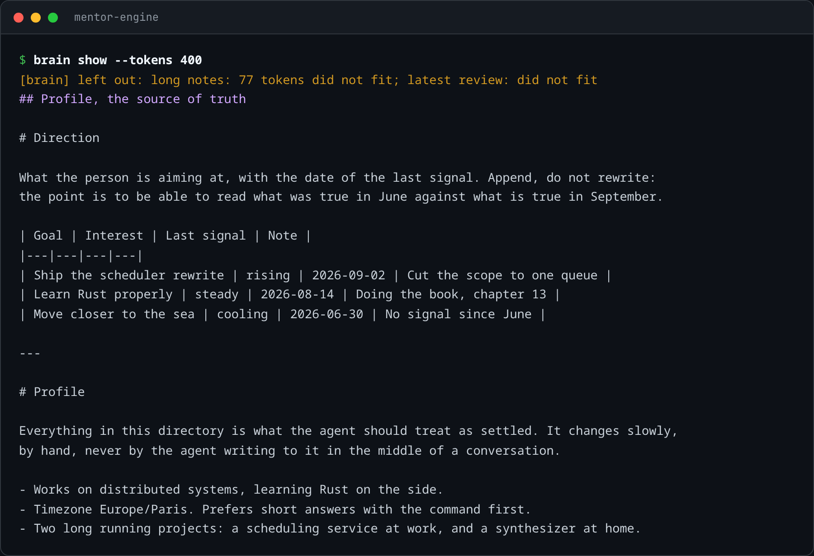

# mentor-engine

**A memory for AI agents, kept as markdown files in a git repository.**

You write to it from anywhere: a script, a phone bot, a coding agent. When an agent needs to
know who it is talking to, it asks for the memory back, and gets as much of it as fits in the
context window, plus a list of what did not fit.



## In one minute

A model forgets everything between two calls. So if you want an assistant that remembers
last Tuesday, you have to store last Tuesday yourself and hand it back every time.

Storing it is easy. Two things are not:

**The memory grows forever, the context window does not.** Something has to be left out on
every call. Cutting at some character count silently removes the middle of a day, and you
get an agent that is confidently missing a week.

**Several clients write at once, with nothing coordinating them.** Mine has four. Two of
them writing in the same second is normal traffic, not an incident.

This repository handles those two, and stays boring everywhere else.

## What it looks like

Ask what the memory costs, and what got left out at a given budget:



Read the daily journal back as structured data, without a database:



Print the context you would put in a system prompt:



## Try it in thirty seconds

```bash
git clone https://github.com/kabylesystem/mentor-engine
cd mentor-engine
export BRAIN_DIR=./example-brain
export BRAIN_GIT=0                      # work on disk, no commits, while you look around

node src/cli.mjs budget --tokens 200    # what fits, what does not
node src/cli.mjs show --tokens 400      # the context itself
node src/cli.mjs journal --days 30      # the journal as JSON
node src/cli.mjs note --type decision "dropped the second queue"
```

`example-brain/` is fictional. Point `BRAIN_DIR` at your own repository when you want a real one.

## The brain

```
brain/
  self/       what is settled, changes slowly, edited by hand
  journal/    one file per day, one line per event, append only
  notes/      long notes kept whole, one file each
  reviews/    periodic summaries, the most recent one is read back
```

The split between `self/` and `journal/` is the decision everything else rests on. An agent
allowed to rewrite the profile will drift it toward whatever was said five minutes ago, and
you will not notice for a month. So the profile changes by hand, and everything an agent
writes is appended, dated, and labelled with the client that wrote it.

A journal line looks like this, written for a human and shaped so a machine can read it too:

```
- 14:30 [cli] (decision) dropped the second queue, one is enough
```

## How the budget works

`assemble({ tokens })` fills the window in a fixed order and reports the result.

1. **The profile is never dropped.** It is small and it makes everything else legible. If it
   alone exceeds the budget it is kept anyway, and the overrun is reported as an error.
2. **The journal is added newest day first, one file at a time.** A day that does not fit
   whole is skipped whole. Half a day is worse than no day: an agent reading a truncated
   Tuesday answers as if it knows Tuesday.
3. **Long notes, then the latest review**, while budget remains.

```js
const { text, tokens, dropped } = assemble({ tokens: 12_000, dir: '/srv/brain' });
if (dropped.length) console.warn('context is incomplete:', dropped);
// dropped: [ 'journal: 11 day files did not fit' ]
```

The token count is a heuristic, four characters per token by default and configurable. It
decides what fits. Use your provider's tokenizer if you need an exact number for billing.

## How concurrent writes work

Every write is an append to a line or a brand new file, so two clients never disagree about
content, only about git. A push failing means someone committed first, which is the ordinary
case here rather than an error.

So `commit` treats it as ordinary: commit, try to push, and on failure pull with rebase and
retry with a growing pause, four times by default. If the rebase itself fails it aborts
cleanly and leaves the work on disk rather than half applied. Every write returns what
happened, so a caller can tell "written and pushed" from "written locally, push is behind".

```js
const { file, sync } = appendNote('the queue drains in 40 seconds', { source: 'telegram', type: 'fact' });
// sync: { committed: true, pushed: true, attempts: 2 }
```

## Note types

Five, on purpose. Enough to sort a week, few enough to pick one without thinking.

| Type | For |
|---|---|
| `fact` | something that happened |
| `decision` | a call that was made, and what it rules out |
| `commitment` | something the person said they would do |
| `want` | a desire that appeared or grew |
| `state` | how they are, when it explains the rest |

An unknown type is refused rather than stored. A memory where anything can be written stops
being searchable within a month.

## What it does not do

- **No retrieval, no embeddings.** Selection is by recency and section, not by relevance to
  the question. If your memory no longer fits a window even after budgeting, you want a
  retrieval layer, and this is the wrong tool.
- **No merge resolution.** Rebase covers the ordinary case. A real content conflict is
  reported and left to a human.
- **No access control.** Anyone who can read the repository can read the memory. That is why
  mine is private and only the engine is public.

## Environment

| Variable | Default | Meaning |
|---|---|---|
| `BRAIN_DIR` | `./brain` | path to the brain repository |
| `BRAIN_TZ` | `UTC` | timezone used to date entries |
| `BRAIN_JOURNAL_DAYS` | `21` | how far back the journal is read |
| `BRAIN_TOKENS` | none | default budget for `show` and `budget` |
| `BRAIN_CHARS_PER_TOKEN` | `4` | the token estimate |
| `BRAIN_PUSH_ATTEMPTS` | `4` | pushes tried before giving up |
| `BRAIN_GIT` | on | set to `0` to work on disk without committing |
| `BRAIN_SOURCE` | `cli` | label written next to each entry |

## Tests

```bash
npm test
```

Twelve tests. The ones worth reading are the budget cases: a day file that does not fit is
skipped whole, a profile larger than the entire budget is kept and reported, and an unknown
note type is refused.

## License

MIT.
